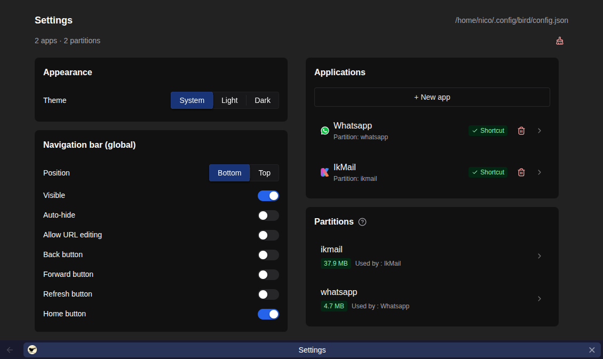
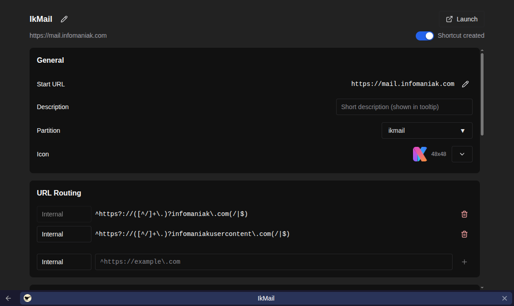
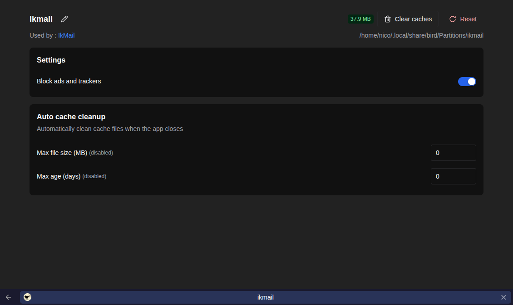

# Bird

**Desktop, redistribuable, isolated browser.**

Bird turns any website into a standalone desktop application with complete session isolation, advanced kiosk mode, and (WIP) enterprise-ready packaging.

<details>
<summary>📸 Screenshots</summary>





</details>

## Why Bird?

- **Session Isolation**: Run Gmail, Slack, Notion as separate apps — each with its own partition (cookies, localStorage, cache). No more "you're signed into another account" issues.
- **Ship Your SaaS as a Desktop App** *(WIP)*: Package Bird with a locked config to distribute your web app as a native desktop experience — branded, installable, out of the browser.
- **Kiosk Mode**: Lock terminals to specific URLs with custom escape shortcuts — perfect for dashboards, public kiosks, or digital signage.
- **User-Agent Spoofing**: Test mobile layouts, browser-specific features, or bypass Electron detection without switching browsers.

## Platforms

- **Linux** — AppImage, Asar, Flatpak (planned)
- **Windows** — NSIS installer
- **macOS** — WIP

> **Arch Linux**: `yay -S bird-apps-bin`

## Features

| Feature | Description |
|---------|-------------|
| **Configuration UI** | Visual interface to manage apps, partitions, and settings |
| **i18n** | 10 languages (EN, FR, DE, ES, PT, IT, RU, ZH, AR, HI) |
| **Themes** | System, light, or dark mode |
| **Desktop Shortcuts** | Deploy apps as native shortcuts (.desktop on Linux, Start Menu on Windows) |
| **Navigation Bar** | Configurable (position, buttons, auto-hide, URL editing) |
| **Tab Management** | Multi-tab support with smart validation |
| **URL Routing** | Control which links open internally, externally, or get blocked |
| **Downloads** | Auto-open by MIME type, configurable directory, dangerous file detection |
| **Find in Page** | Built-in find with match highlighting |
| **Partition Isolation** | Each app has its own session (cookies, storage, cache) with cache limits (max age, max size) |
| **Ad Blocking** | Built-in ad blocker powered by Ghostery |
| **Kiosk Mode** | Fullscreen lock with custom exit shortcut |
| **User-Agent Presets** | Chrome, Firefox, Safari, Edge, mobile devices, even IE6 |

## Quick Start

### Run from source

```bash
# Prerequisites: Node.js >= 20, pnpm

pnpm install
pnpm dev
```

### Build & Package

```bash
pnpm build                    # Build for production
pnpm package:appimage         # Create AppImage (Linux)
pnpm package:win              # Create installer (Windows)
```

## Usage

```bash
# Open configuration UI
bird

# Launch a specific app
bird --app gmail

# Browser mode (quick access to any URL)
bird https://example.com

# Kiosk mode with exit shortcut
bird --app dashboard --kiosk Ctrl+Alt+K

# Test with different user-agent
bird --app myapp --userAgent mobile:chrome

# Complete uninstall (remove shortcuts, data, config)
bird --cleanall
```

## Configuration

Bird uses a JSON configuration file (`~/.config/bird/config.json` or via `--config`).

```json
{
  "theme": "system",
  "navBar": {
    "position": "bottom",
    "autoHide": true
  },
  "apps": {
    "gmail": {
      "partition": "gmail",
      "startUrl": "https://mail.google.com",
      "routing": {
        "rules": {
          "^https://[^/]*\\.google\\.com": "internal"
        }
      }
    },
    "slack": {
      "partition": "slack",
      "startUrl": "https://app.slack.com",
      "userAgent": "desktop:chrome"
    }
  }
}
```

## Documentation

- [DEVELOPMENT.md](DEVELOPMENT.md) — Setup, commands, debugging
- [ARCHITECTURE.md](ARCHITECTURE.md) — Project structure, patterns, data flow
- [CONTRIBUTING.md](CONTRIBUTING.md) — Code philosophy, conventions

## Tech Stack

- **Electron 39** — Desktop runtime
- **TypeScript 5.9** — Type safety
- **React 19** — UI components
- **Chakra UI** — Component library
- **Zod** — Schema validation (types = validation)
- **Biome** — Linting & formatting
- **electron-vite** — Build tooling
- **Ghostery** — Ad blocking

## License

[MIT](LICENSE)
